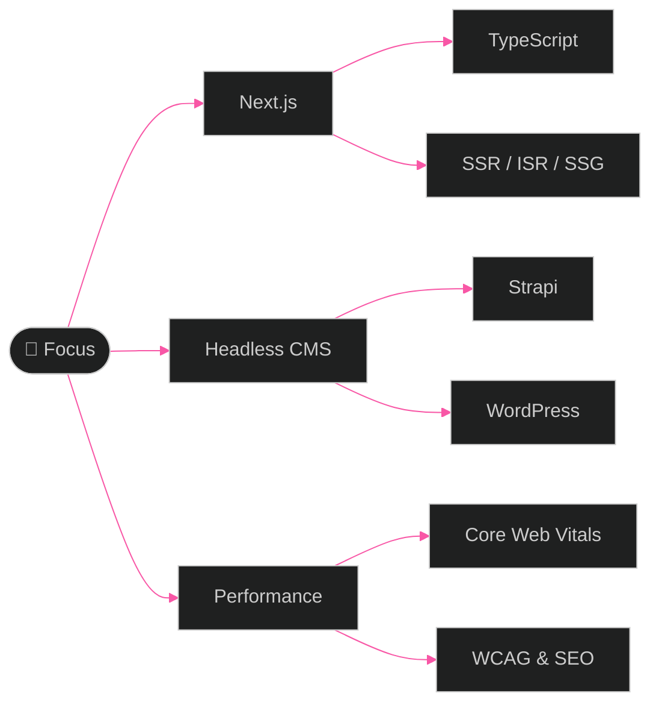

<div align="center">

<!-- Aurora Header -->


<!-- Profile Badges -->
<p align="center">
  <a href="https://www.linkedin.com/in/alaa-el-sheikh/"></a>
  <a href="mailto:3laamohamed19@gmail.com"></a>
  
  
  
  
</p>

<!-- Typing Animation -->
<p align="center">
  
</p>


</div>

<!-- About Me -->
<table align="center">
<tr>
<td width="52%">


<br>

```typescript
interface Developer {
  name: string;
  role: string;
  company: string;
  location: string;
  education: string;
  specialties: string[];
  currentlyLearning: string;
  expertise: string[];
}

const alaaElSheikh: Developer = {
  name: "Alaa Mohamed Sedek El-Sheikh",
  role: "Frontend Engineer",
  company: "Mitch Designs",
  location: "Cairo, Egypt 🇪🇬",
  education: "B.Sc. CS — MTI University",
  specialties: [
    "⚛️ Next.js & React Applications",
    "🎨 Responsive UI with Tailwind CSS",
    "🚀 SSR / ISR / SSG Performance",
    "♿ WCAG Accessibility & SEO",
    "🧪 Jest & React Testing Library"
  ],
  currentlyLearning: "Advanced Headless CMS & CI/CD",
  expertise: [
    "Headless websites with Strapi & WordPress",
    "Core Web Vitals optimization",
    "Clean component-driven architecture"
  ]
};
```

</td>
<td width="48%">


</td>
</tr>
</table>

<p align="center">
  
</p>

<!-- Specialization -->
<div align="center">


<br><br>

### ⚛️ Next.js & Modern Frontend Engineering

I build **high-performance, accessible web applications** with **Next.js**, **TypeScript**, and **headless CMS** integrations.

<table>
<tr>
<td width="50%">

#### 🔧 What I Do
- ⚡ **Next.js & React** — component-driven UIs, SSR/ISR/SSG
- 🗂️ **Headless CMS** — Strapi & WordPress via REST/GraphQL
- 🎨 **Performance** — Core Web Vitals, image optimization, code-splitting
- 🧪 **Quality** — Jest, RTL, ESLint, WCAG & SEO best practices

</td>
<td width="50%">

#### 💼 Experience
- 🏢 **Mitch Designs** — Front-End Developer `Jul 2024 – Present`
- 🏢 **USAM** — Internship `Apr – Jul 2024`
- 🏢 **Route** — Internship `Apr – Oct 2023`

#### 📜 Education
- 🎓 **B.Sc. Computer Science** — MTI University
- 📜 **React.js Diploma** — Route Academy

> *Delivering clean, maintainable, blazing-fast experiences*

</td>
</tr>
</table>

</div>

<p align="center">
  
</p>

<!-- Stats -->
<div align="center">


<br><br>


</div>

<p align="center">
  
</p>

<!-- Technologies -->
<div align="center">


<br><br>


<br><br>

<details open>
<summary><b>🎨 Frontend</b></summary>
<br>
<p align="center">
  
  
  
  
  
  
  
  
  
  
</p>
</details>

<details open>
<summary><b>🗂️ CMS, APIs & Testing</b></summary>
<br>
<p align="center">
  
  
  
  
  
  
  
  
  
</p>
</details>

</div>

<p align="center">
  
</p>

<!-- Activity -->
<div align="center">


<br><br>


</div>

<br>

<!-- Languages & Summary -->
<div align="center">


<br><br>


<br><br>


</div>

<p align="center">
  
</p>

<!-- Trophies -->
<div align="center">


<br><br>


</div>

<p align="center">
  
</p>

<!-- Learning Path -->
<div align="center">


<br><br>



</div>

<p align="center">
  
</p>

<!-- Projects -->
<div align="center">


<br><br>

<table>
<tr>
<td width="33%" align="center">

### 🛒 E-Commerce
React store with cart & checkout

[](https://github.com/3laaelsheikh/E-Commerce-App)

</td>
<td width="33%" align="center">

### 🍽️ Yummy
Meals, recipes & video guides

[](https://github.com/3laaelsheikh/Yummy-app)

</td>
<td width="33%" align="center">

### 🌤️ Weather
3-day forecast & hourly data

[](https://github.com/3laaelsheikh/Weather-app)

</td>
</tr>
<tr>
<td width="33%" align="center">

### 🔐 Login System
Auth with welcome dashboard

[](https://github.com/3laaelsheikh/Login-System-app)

</td>
<td width="33%" align="center">

### 💪 Fitnut
Fitness & nutrition tracker

[](https://github.com/3laaelsheikh/Fitnut)

</td>
<td width="33%" align="center">

### 📦 All Projects
16+ repos on GitHub

[](https://github.com/3laaelsheikh?tab=repositories)

</td>
</tr>
</table>

</div>

<br>

<!-- Quote -->
<div align="center">


<br>


<br>

<i>"Great frontend is invisible — users feel the experience, not the code"</i>

</div>

<p align="center">
  
</p>

<!-- Connect -->
<div align="center">


<br><br>

<i>Looking for a Frontend Engineer to build fast, accessible Next.js apps?</i><br>
<i>Let's build something amazing together!</i>

<br><br>

<a href="https://www.linkedin.com/in/alaa-el-sheikh/"></a>
<a href="mailto:3laamohamed19@gmail.com"></a>
<a href="https://twitter.com/3laa_elsheikh"></a>
<a href="https://www.facebook.com/alaamohamed"></a>
<a href="https://instagram.com/3laa_elsheikh"></a>

<br><br>


</div>

<br>

<!-- Footer -->
<div align="center">


<h3><i>⚡ Code with purpose · Ship with confidence · Optimize with passion</i></h3>


<p>
  <i>Made with 💜 by <b>Alaa Mohamed Sedek El-Sheikh</b></i><br>
  <i>© 2026 All rights reserved</i>
</p>

</div>
