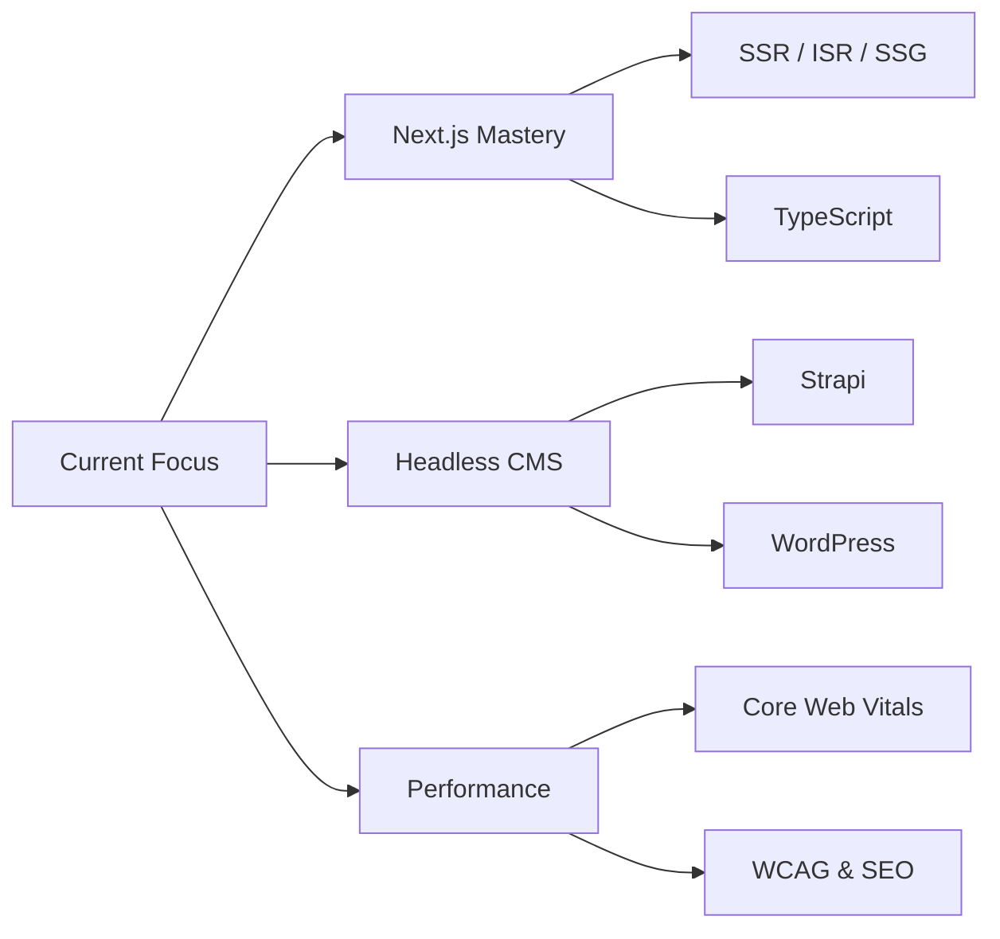

<div align="center">

<!-- Animated Header -->


<!-- Profile Badges -->
<p align="center">
  <a href="https://www.linkedin.com/in/alaa-el-sheikh/"></a>
  <a href="mailto:3laamohamed19@gmail.com"></a>
  
  
  
  
</p>

<!-- Animated Typing -->
<p align="center">
  <a href="https://git.io/typing-svg">
    
  </a>
</p>

</div>

<!-- Gradient Divider -->
<p align="center">
  
</p>

<!-- About Me -->
<table align="center">
<tr>
<td width="50%">

## 🚀 About Me

```typescript
interface Developer {
  name: string;
  role: string;
  company: string;
  location: string;
  education: string;
  specialties: string[];
  currentlyLearning: string;
  expertise: string[];
}

const alaaElSheikh: Developer = {
  name: "Alaa Mohamed Sedek El-Sheikh",
  role: "Frontend Engineer",
  company: "Mitch Designs",
  location: "Cairo, Egypt 🇪🇬",
  education: "B.Sc. CS — MTI University",
  specialties: [
    "⚛️ Next.js & React Applications",
    "🎨 Responsive UI with Tailwind CSS",
    "🚀 SSR / ISR / SSG Performance",
    "♿ WCAG Accessibility & SEO",
    "🧪 Jest & React Testing Library"
  ],
  currentlyLearning: "Advanced Headless CMS & CI/CD",
  expertise: [
    "Headless websites with Strapi & WordPress",
    "Core Web Vitals optimization",
    "Clean component-driven architecture"
  ]
};
```

</td>
<td width="50%">


</td>
</tr>
</table>

<!-- Gradient Divider -->
<p align="center">
  
</p>

<!-- Specialization -->
<h2 align="center">🎯 Current Specialization</h2>

<div align="center">

### ⚛️ Next.js & Modern Frontend Engineering

I specialize in building **high-performance, accessible web applications** with **Next.js**, **TypeScript**, and **headless CMS** integrations!

<table>
<tr>
<td width="50%">

#### 🔧 What I Do:
- ⚡ **Next.js & React Development**
  - Scalable component-driven UIs
  - SSR, ISR & SSG data fetching
  - Image optimization & code-splitting

- 🗂️ **Headless CMS Integration**
  - Strapi & WordPress (REST / GraphQL)
  - Admin dashboards & data entry flows
  - Secure API token handling

- 🎨 **Performance & Quality**
  - Core Web Vitals optimization
  - WCAG accessibility standards
  - Jest & RTL unit testing

</td>
<td width="50%">

#### 💼 Experience:
- 🏢 **Mitch Designs** — Front-End Developer `Jul 2024 – Present`
- 🏢 **USAM** — Internship `Apr – Jul 2024`
- 🏢 **Route** — Internship `Apr – Oct 2023`

#### 📜 Education & Certs:
- 🎓 **B.Sc. Computer Science** — MTI University
- 📜 **React.js Diploma** — Route Academy

#### 💡 My Goal:
> Delivering clean, maintainable, and blazing-fast web experiences that users love

</td>
</tr>
</table>

</div>

<!-- Gradient Divider -->
<p align="center">
  
</p>

<!-- Quick Stats -->
<h2 align="center">📊 Quick Stats Overview</h2>

<p align="center">
  
  
</p>

<!-- Technologies -->
<h2 align="center">💻 Technologies & Tools</h2>

<details open>
<summary><b>🎨 Frontend Technologies</b></summary>
<br>
<p align="center">
  
  
  
  
  
  
  
  
  
  
  
</p>
</details>

<details open>
<summary><b>🗂️ CMS & APIs</b></summary>
<br>
<p align="center">
  
  
  
  
  
  
</p>
</details>

<details open>
<summary><b>🧪 Testing & DevOps</b></summary>
<br>
<p align="center">
  
  
  
  
  
  
</p>
</details>

<details open>
<summary><b>🛠️ Tools & Platforms</b></summary>
<br>
<p align="center">
  
  
  
  
  
  
</p>
</details>

<!-- Gradient Divider -->
<p align="center">
  
</p>

<!-- Activity Graph -->
<h2 align="center">📈 Contribution Activity</h2>

<p align="center">
  
</p>

<!-- Language Stats -->
<h2 align="center">📊 Language Statistics</h2>

<p align="center">
  
</p>

<!-- Profile Summary -->
<h2 align="center">💳 GitHub Profile Summary</h2>

<p align="center">
  
</p>

<p align="center">
  
  
  
</p>

<!-- Trophies -->
<h2 align="center">🏆 GitHub Achievements</h2>

<p align="center">
  
</p>

<!-- Gradient Divider -->
<p align="center">
  
</p>

<!-- Learning Path -->
<h2 align="center">🎯 Current Focus & Learning Path</h2>

<div align="center">



</div>

<!-- Featured Projects -->
<h2 align="center">🛠️ Featured Projects</h2>

<div align="center">

<table>
<tr>
<td width="33%" align="center">

### 🛒 E-Commerce App
React shopping app with cart & online checkout

[](https://github.com/3laaelsheikh/E-Commerce-App)

</td>
<td width="33%" align="center">

### 🍽️ Yummy App
World meals with recipes & video guides

[](https://github.com/3laaelsheikh/Yummy-app)

</td>
<td width="33%" align="center">

### 🌤️ Weather App
3-day forecast with hourly weather data

[](https://github.com/3laaelsheikh/Weather-app)

</td>
</tr>
<tr>
<td width="33%" align="center">

### 🔐 Login System
Smart auth with registration & welcome flow

[](https://github.com/3laaelsheikh/Login-System-app)

</td>
<td width="33%" align="center">

### 💪 Fitnut
Fitness & nutrition tracking application

[](https://github.com/3laaelsheikh/Fitnut)

</td>
<td width="33%" align="center">

### 📦 More Projects
Explore all 16+ repositories on GitHub

[](https://github.com/3laaelsheikh?tab=repositories)

</td>
</tr>
</table>

</div>

<!-- Philosophy -->
<h2 align="center">💡 Philosophy</h2>

<p align="center">
  
</p>

<p align="center">
  <i>"Great frontend is invisible — users feel the experience, not the code"</i>
</p>

<!-- Connect -->
<h2 align="center">🤝 Let's Connect!</h2>

<div align="center">

  <p>
    <i>Looking for a Frontend Engineer to build fast, accessible Next.js applications?</i><br>
    <i>Let's collaborate and build something amazing together!</i>
  </p>

  <a href="https://www.linkedin.com/in/alaa-el-sheikh/">
    
  </a>
  <a href="mailto:3laamohamed19@gmail.com">
    
  </a>
  <a href="https://twitter.com/3laa_elsheikh">
    
  </a>
  <a href="https://www.facebook.com/alaamohamed">
    
  </a>
  <a href="https://instagram.com/3laa_elsheikh">
    
  </a>

  <br><br>

  
  
  

</div>

<!-- Footer -->
<p align="center">
  
</p>

<h3 align="center">
  <i>⚡ "Code with purpose, ship with confidence, optimize with passion"</i>
</h3>

<p align="center">
  <i>Made with ❤️ by <b>Alaa Mohamed Sedek El-Sheikh</b></i>
  <br>
  <i>© 2026 All rights reserved</i>
</p>
